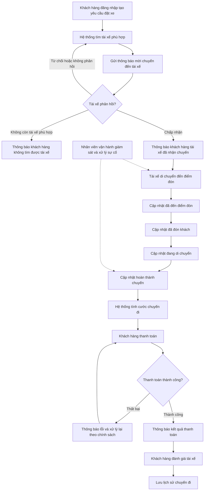

## 📋 Tổng quan dự án

### Bối cảnh
Công ty ABC hiện cung cấp dịch vụ đặt xe qua tổng đài và ứng dụng đơn giản, nhưng còn hạn chế: phân công tài xế thủ công, khó theo dõi chuyến đi, thanh toán chưa tập trung, khó mở rộng hệ thống.

### Mục tiêu dự án
Xây dựng nền tảng CAB mới có khả năng:
- Phục vụ số lượng lớn khách hàng & tài xế
- Tự động hóa tìm và phân công tài xế
- Quản lý tập trung chuyến đi, thanh toán, người dùng
- Kiến trúc linh hoạt, dễ mở rộng dịch vụ/thanh toán/thông báo trong tương lai

### Phạm vi
Ba nhóm người dùng chính: **Khách hàng**, **Tài xế**, **Nhân viên vận hành**.
Luồng nghiệp vụ chính: đặt xe → tìm & phân công tài xế → thực hiện chuyến → tính cước & thanh toán → thông báo → đánh giá.

### Thời gian triển khai
**7 tuần** (từ phân tích yêu cầu đến triển khai sản phẩm).

### Vai trò Business Analyst
Làm rõ phạm vi, tác nhân, quy trình nghiệp vụ, yêu cầu chức năng/phi chức năng, quy tắc nghiệp vụ, ngoại lệ và các vấn đề chưa chốt với các bên liên quan trước khi Dev triển khai.
## 📌 Phân tích Stakeholder

### Stakeholder chính (Primary)

| Stakeholder | Vai trò | Ảnh hưởng | Quan tâm | Kỳ vọng chính |
|---|---|---|---|---|
| Khách hàng | Đặt xe, theo dõi chuyến, thanh toán, đánh giá | Trung bình | Cao | Trải nghiệm đặt xe nhanh, minh bạch |
| Tài xế | Nhận/thực hiện chuyến, cập nhật trạng thái | Trung bình | Cao | Nhận chuyến kịp thời, phân chuyến công bằng |
| Nhân viên vận hành | Quản trị khách hàng/tài xế/phương tiện, xử lý sự cố | Cao | Cao | Giao diện quản trị, báo cáo, phân quyền |

### Stakeholder gián tiếp (Secondary)

| Stakeholder | Vai trò | Ảnh hưởng | Quan tâm | Kỳ vọng chính |
|---|---|---|---|---|
| Ban giám đốc / Ban lãnh đạo | Sponsor, ra quyết định chiến lược | Rất cao | Cao | Hệ thống mở rộng, báo cáo doanh thu/hiệu suất |
| Business Analyst | Làm rõ yêu cầu, phạm vi, quy tắc nghiệp vụ | Cao | Cao | Thông tin đầy đủ để đặc tả chính xác |
| Nhóm phát triển | Xây dựng giải pháp kỹ thuật | Trung bình | Trung bình | Yêu cầu rõ ràng, kiến trúc modular |
| Nhà cung cấp thanh toán bên ngoài | Đối tác xử lý giao dịch điện tử | Trung bình | Thấp | Tích hợp API, không lưu dữ liệu nhạy cảm |
| Nhà cung cấp thông báo (tương lai) | Mở rộng kênh thông báo | Thấp | Thấp | Kiến trúc dễ mở rộng |

> **Ghi chú:** Ban lãnh đạo là stakeholder có ảnh hưởng cao nhất do quyết định phạm vi & ngân sách. Khách hàng và Tài xế là hai tác nhân vận hành lõi của hệ thống.

## 🎯 Business Context – Bối cảnh & Mục tiêu kinh doanh

### Mục đích kinh doanh
Công ty ABC muốn chuyển đổi từ mô hình đặt xe thủ công (tổng đài + app đơn giản) sang nền tảng công nghệ tự động hóa toàn diện, giải quyết các điểm nghẽn: phân công tài xế thủ công, thiếu minh bạch thông tin chuyến đi, dữ liệu thanh toán phân mảnh, khó mở rộng hệ thống.

### Mục tiêu kinh doanh

| Mục tiêu | Mô tả |
|---|---|
| Tăng năng lực phục vụ | Phục vụ lượng lớn khách hàng & tài xế, đáp ứng cao điểm |
| Tự động hóa vận hành | Loại bỏ phân công thủ công, giảm phụ thuộc tổng đài |
| Minh bạch trải nghiệm khách hàng | Theo dõi real-time toàn bộ vòng đời chuyến đi |
| Tập trung hóa dữ liệu | Thống nhất dữ liệu khách hàng/tài xế/chuyến đi/thanh toán phục vụ báo cáo |
| Sẵn sàng mở rộng lâu dài | Kiến trúc linh hoạt, dễ bổ sung dịch vụ/thanh toán/thông báo mới |

### Giá trị kinh doanh kỳ vọng
- Rút ngắn thời gian ghép chuyến, giảm tỷ lệ khách hàng rời bỏ
- Tăng giữ chân khách hàng & tài xế nhờ trải nghiệm ổn định
- Cung cấp dữ liệu hỗ trợ ra quyết định cho ban lãnh đạo
- Giảm chi phí vận hành nhờ tự động hóa

## 📝 Business Requirements (BR)

| Mã | Business Requirement |
|---|---|
| BR01 | Quản lý tài khoản khách hàng (đăng ký, đăng nhập, cập nhật thông tin) |
| BR02 | Đặt chuyến đi (điểm đón/đến, loại xe, gửi yêu cầu) |
| BR03 | Theo dõi trạng thái chuyến đi theo thời gian thực |
| BR04 | Xem lịch sử chuyến đi và đánh giá tài xế |
| BR05 | Quản lý tài khoản & hồ sơ tài xế (thông tin, phương tiện, trạng thái) |
| BR06 | Tài xế nhận/từ chối chuyến và cập nhật tiến trình chuyến đi |
| BR07 | Tìm và phân công tài xế tự động theo vị trí & trạng thái |
| BR08 | Tính cước chuyến đi tự động |
| BR09 | Thanh toán (tiền mặt & điện tử qua bên thứ 3) |
| BR10 | Thông báo cho khách hàng & tài xế theo các mốc sự kiện |
| BR11 | Quản trị vận hành: khách hàng, tài xế, phương tiện, chuyến đi |
| BR12 | Báo cáo kinh doanh & vận hành |
| BR13 | Bảo mật & phân quyền truy cập hệ thống |

## 🔄 Mô hình hóa quy trình nghiệp vụ (Business Process)

## ⚙️ Functional Requirements (FR)

| BR | FR | Functional Requirement |
|---|---|---|
| BR01 | FR01 | Đăng ký tài khoản bằng số điện thoại/email |
| BR01 | FR02 | Đăng nhập bằng tài khoản đã đăng ký |
| BR01 | FR03 | Cập nhật thông tin cá nhân |
| BR02 | FR04 | Nhập điểm đón và điểm đến trên bản đồ |
| BR02 | FR05 | Lựa chọn loại xe, hiển thị giá ước tính |
| BR02 | FR06 | Gửi yêu cầu đặt xe |
| BR03 | FR07 | Hiển thị trạng thái đang tìm tài xế |
| BR03 | FR08 | Hiển thị thông tin tài xế đã nhận chuyến |
| BR03 | FR09 | Hiển thị thời gian dự kiến tài xế đến (ETA) |
| BR03 | FR10 | Cập nhật trạng thái chuyến real-time |
| BR04 | FR11 | Xem lịch sử chuyến đi |
| BR04 | FR12 | Xem chi tiết một chuyến đi |
| BR04 | FR13 | Đánh giá và nhận xét tài xế |
| BR05 | FR14 | Đăng ký/khởi tạo tài khoản tài xế |
| BR05 | FR15 | Cập nhật hồ sơ & thông tin phương tiện |
| BR05 | FR16 | Chuyển trạng thái hoạt động của tài xế |
| BR06 | FR17 | Gửi thông báo mời chuyến đến tài xế |
| BR06 | FR18 | Chấp nhận/từ chối lời mời chuyến |
| BR06 | FR19 | Cập nhật tiến trình chuyến đi |
| BR07 | FR20 | Ghi nhận vị trí tài xế real-time (GPS) |
| BR07 | FR21 | Xác định tài xế phù hợp theo vị trí & trạng thái |
| BR07 | FR22 | Tự động chuyển tài xế khác nếu bị từ chối |
| BR07 | FR23 | Thông báo khi không tìm được tài xế |
| BR08 | FR24 | Tính cước chuyến đi tự động |
| BR08 | FR25 | Hiển thị chi tiết cước phí sau chuyến |
| BR09 | FR26 | Chọn phương thức thanh toán (tiền mặt/điện tử) |
| BR09 | FR27 | Tích hợp cổng thanh toán bên ngoài |
| BR09 | FR28 | Không lưu thông tin thẻ/tài khoản thanh toán |
| BR09 | FR29 | Xử lý khi giao dịch thanh toán thất bại |
| BR10 | FR30 | Thông báo khách hàng theo các mốc sự kiện |
| BR10 | FR31 | Thông báo tài xế khi có chuyến mới/thay đổi |
| BR10 | FR32 | Kiến trúc module hóa để mở rộng kênh thông báo |
| BR11 | FR33 | Giao diện quản trị khách hàng/tài xế/phương tiện |
| BR11 | FR34 | Xem chuyến đi đang diễn ra real-time |
| BR11 | FR35 | Xử lý sự cố chuyến đi |
| BR11 | FR36 | Tra cứu lịch sử giao dịch |
| BR12 | FR37 | Báo cáo số lượng chuyến đi |
| BR12 | FR38 | Báo cáo doanh thu |
| BR12 | FR39 | Báo cáo tỷ lệ hoàn thành/hủy chuyến |
| BR12 | FR40 | Báo cáo hiệu quả hoạt động tài xế |
| BR13 | FR41 | Xác thực người dùng trước khi truy cập chức năng |
| BR13 | FR42 | Phân quyền chức năng theo vai trò |
| BR13 | FR43 | Ghi log thao tác quan trọng (audit trail) |
