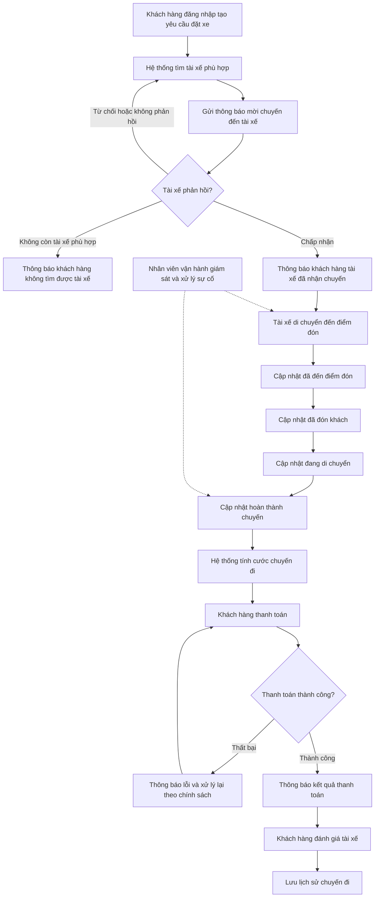
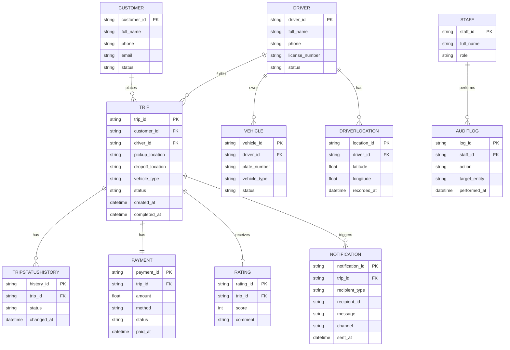
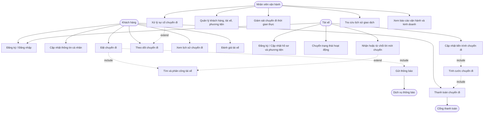

## 📋 Tổng quan dự án

### Bối cảnh
Công ty ABC hiện cung cấp dịch vụ đặt xe qua tổng đài và ứng dụng đơn giản, nhưng còn hạn chế: phân công tài xế thủ công, khó theo dõi chuyến đi, thanh toán chưa tập trung, khó mở rộng hệ thống.

### Mục tiêu dự án
Xây dựng nền tảng CAB mới có khả năng:
- Phục vụ số lượng lớn khách hàng & tài xế
- Tự động hóa tìm và phân công tài xế
- Quản lý tập trung chuyến đi, thanh toán, người dùng
- Kiến trúc linh hoạt, dễ mở rộng dịch vụ/thanh toán/thông báo trong tương lai

### Phạm vi
Ba nhóm người dùng chính: **Khách hàng**, **Tài xế**, **Nhân viên vận hành**.
Luồng nghiệp vụ chính: đặt xe → tìm & phân công tài xế → thực hiện chuyến → tính cước & thanh toán → thông báo → đánh giá.

### Thời gian triển khai
**7 tuần** (từ phân tích yêu cầu đến triển khai sản phẩm).

### Vai trò Business Analyst
Làm rõ phạm vi, tác nhân, quy trình nghiệp vụ, yêu cầu chức năng/phi chức năng, quy tắc nghiệp vụ, ngoại lệ và các vấn đề chưa chốt với các bên liên quan trước khi Dev triển khai.
## 📌 Phân tích Stakeholder

### Stakeholder chính (Primary)

| Stakeholder | Vai trò | Ảnh hưởng | Quan tâm | Kỳ vọng chính |
|---|---|---|---|---|
| Khách hàng | Đặt xe, theo dõi chuyến, thanh toán, đánh giá | Trung bình | Cao | Trải nghiệm đặt xe nhanh, minh bạch |
| Tài xế | Nhận/thực hiện chuyến, cập nhật trạng thái | Trung bình | Cao | Nhận chuyến kịp thời, phân chuyến công bằng |
| Nhân viên vận hành | Quản trị khách hàng/tài xế/phương tiện, xử lý sự cố | Cao | Cao | Giao diện quản trị, báo cáo, phân quyền |

### Stakeholder gián tiếp (Secondary)

| Stakeholder | Vai trò | Ảnh hưởng | Quan tâm | Kỳ vọng chính |
|---|---|---|---|---|
| Ban giám đốc / Ban lãnh đạo | Sponsor, ra quyết định chiến lược | Rất cao | Cao | Hệ thống mở rộng, báo cáo doanh thu/hiệu suất |
| Business Analyst | Làm rõ yêu cầu, phạm vi, quy tắc nghiệp vụ | Cao | Cao | Thông tin đầy đủ để đặc tả chính xác |
| Nhóm phát triển | Xây dựng giải pháp kỹ thuật | Trung bình | Trung bình | Yêu cầu rõ ràng, kiến trúc modular |
| Nhà cung cấp thanh toán bên ngoài | Đối tác xử lý giao dịch điện tử | Trung bình | Thấp | Tích hợp API, không lưu dữ liệu nhạy cảm |
| Nhà cung cấp thông báo (tương lai) | Mở rộng kênh thông báo | Thấp | Thấp | Kiến trúc dễ mở rộng |

> **Ghi chú:** Ban lãnh đạo là stakeholder có ảnh hưởng cao nhất do quyết định phạm vi & ngân sách. Khách hàng và Tài xế là hai tác nhân vận hành lõi của hệ thống.

## 🎯 Business Context – Bối cảnh & Mục tiêu kinh doanh

### Mục đích kinh doanh
Công ty ABC muốn chuyển đổi từ mô hình đặt xe thủ công (tổng đài + app đơn giản) sang nền tảng công nghệ tự động hóa toàn diện, giải quyết các điểm nghẽn: phân công tài xế thủ công, thiếu minh bạch thông tin chuyến đi, dữ liệu thanh toán phân mảnh, khó mở rộng hệ thống.

### Mục tiêu kinh doanh

| Mục tiêu | Mô tả |
|---|---|
| Tăng năng lực phục vụ | Phục vụ lượng lớn khách hàng & tài xế, đáp ứng cao điểm |
| Tự động hóa vận hành | Loại bỏ phân công thủ công, giảm phụ thuộc tổng đài |
| Minh bạch trải nghiệm khách hàng | Theo dõi real-time toàn bộ vòng đời chuyến đi |
| Tập trung hóa dữ liệu | Thống nhất dữ liệu khách hàng/tài xế/chuyến đi/thanh toán phục vụ báo cáo |
| Sẵn sàng mở rộng lâu dài | Kiến trúc linh hoạt, dễ bổ sung dịch vụ/thanh toán/thông báo mới |

### Giá trị kinh doanh kỳ vọng
- Rút ngắn thời gian ghép chuyến, giảm tỷ lệ khách hàng rời bỏ
- Tăng giữ chân khách hàng & tài xế nhờ trải nghiệm ổn định
- Cung cấp dữ liệu hỗ trợ ra quyết định cho ban lãnh đạo
- Giảm chi phí vận hành nhờ tự động hóa

## 📝 Business Requirements (BR)

| Mã | Business Requirement |
|---|---|
| BR01 | Quản lý tài khoản khách hàng (đăng ký, đăng nhập, cập nhật thông tin) |
| BR02 | Đặt chuyến đi (điểm đón/đến, loại xe, gửi yêu cầu) |
| BR03 | Theo dõi trạng thái chuyến đi theo thời gian thực |
| BR04 | Xem lịch sử chuyến đi và đánh giá tài xế |
| BR05 | Quản lý tài khoản & hồ sơ tài xế (thông tin, phương tiện, trạng thái) |
| BR06 | Tài xế nhận/từ chối chuyến và cập nhật tiến trình chuyến đi |
| BR07 | Tìm và phân công tài xế tự động theo vị trí & trạng thái |
| BR08 | Tính cước chuyến đi tự động |
| BR09 | Thanh toán (tiền mặt & điện tử qua bên thứ 3) |
| BR10 | Thông báo cho khách hàng & tài xế theo các mốc sự kiện |
| BR11 | Quản trị vận hành: khách hàng, tài xế, phương tiện, chuyến đi |
| BR12 | Báo cáo kinh doanh & vận hành |
| BR13 | Bảo mật & phân quyền truy cập hệ thống |

## 🔄 Mô hình hóa quy trình nghiệp vụ (Business Process)

## ⚙️ Functional Requirements (FR)

| BR | FR | Functional Requirement |
|---|---|---|
| BR01 | FR01 | Đăng ký tài khoản bằng số điện thoại/email |
| BR01 | FR02 | Đăng nhập bằng tài khoản đã đăng ký |
| BR01 | FR03 | Cập nhật thông tin cá nhân |
| BR02 | FR04 | Nhập điểm đón và điểm đến trên bản đồ |
| BR02 | FR05 | Lựa chọn loại xe, hiển thị giá ước tính |
| BR02 | FR06 | Gửi yêu cầu đặt xe |
| BR03 | FR07 | Hiển thị trạng thái đang tìm tài xế |
| BR03 | FR08 | Hiển thị thông tin tài xế đã nhận chuyến |
| BR03 | FR09 | Hiển thị thời gian dự kiến tài xế đến (ETA) |
| BR03 | FR10 | Cập nhật trạng thái chuyến real-time |
| BR04 | FR11 | Xem lịch sử chuyến đi |
| BR04 | FR12 | Xem chi tiết một chuyến đi |
| BR04 | FR13 | Đánh giá và nhận xét tài xế |
| BR05 | FR14 | Đăng ký/khởi tạo tài khoản tài xế |
| BR05 | FR15 | Cập nhật hồ sơ & thông tin phương tiện |
| BR05 | FR16 | Chuyển trạng thái hoạt động của tài xế |
| BR06 | FR17 | Gửi thông báo mời chuyến đến tài xế |
| BR06 | FR18 | Chấp nhận/từ chối lời mời chuyến |
| BR06 | FR19 | Cập nhật tiến trình chuyến đi |
| BR07 | FR20 | Ghi nhận vị trí tài xế real-time (GPS) |
| BR07 | FR21 | Xác định tài xế phù hợp theo vị trí & trạng thái |
| BR07 | FR22 | Tự động chuyển tài xế khác nếu bị từ chối |
| BR07 | FR23 | Thông báo khi không tìm được tài xế |
| BR08 | FR24 | Tính cước chuyến đi tự động |
| BR08 | FR25 | Hiển thị chi tiết cước phí sau chuyến |
| BR09 | FR26 | Chọn phương thức thanh toán (tiền mặt/điện tử) |
| BR09 | FR27 | Tích hợp cổng thanh toán bên ngoài |
| BR09 | FR28 | Không lưu thông tin thẻ/tài khoản thanh toán |
| BR09 | FR29 | Xử lý khi giao dịch thanh toán thất bại |
| BR10 | FR30 | Thông báo khách hàng theo các mốc sự kiện |
| BR10 | FR31 | Thông báo tài xế khi có chuyến mới/thay đổi |
| BR10 | FR32 | Kiến trúc module hóa để mở rộng kênh thông báo |
| BR11 | FR33 | Giao diện quản trị khách hàng/tài xế/phương tiện |
| BR11 | FR34 | Xem chuyến đi đang diễn ra real-time |
| BR11 | FR35 | Xử lý sự cố chuyến đi |
| BR11 | FR36 | Tra cứu lịch sử giao dịch |
| BR12 | FR37 | Báo cáo số lượng chuyến đi |
| BR12 | FR38 | Báo cáo doanh thu |
| BR12 | FR39 | Báo cáo tỷ lệ hoàn thành/hủy chuyến |
| BR12 | FR40 | Báo cáo hiệu quả hoạt động tài xế |
| BR13 | FR41 | Xác thực người dùng trước khi truy cập chức năng |
| BR13 | FR42 | Phân quyền chức năng theo vai trò |
| BR13 | FR43 | Ghi log thao tác quan trọng (audit trail) |

## 📐 Business Rules (Quy tắc nghiệp vụ)

### 1. Tài khoản & Xác thực
| Mã | Business Rule |
|---|---|
| RN01 | Phải xác thực trước khi dùng chức năng yêu cầu tài khoản |
| RN02 | Một SĐT/email chỉ đăng ký được 1 tài khoản khách hàng hoặc 1 tài khoản tài xế |
| RN03 | Tài xế phải được xác minh hồ sơ & phương tiện mới được nhận chuyến |

### 2. Đặt chuyến đi
| Mã | Business Rule |
|---|---|
| RN04 | Khách hàng chỉ có 1 yêu cầu đặt xe active tại một thời điểm |
| RN05 | Yêu cầu đặt xe phải đủ điểm đón, điểm đến, loại xe |
| RN06 | Giá ước tính chỉ tham khảo, giá cuối tính lại sau khi hoàn thành chuyến |

### 3. Tìm & phân công tài xế
| Mã | Business Rule |
|---|---|
| RN07 | Chỉ tài xế "sẵn sàng" mới được xét nhận chuyến |
| RN08 | Ưu tiên tài xế gần nhất, sau đó theo tiêu chí vận hành khác |
| RN09 | Tài xế không phản hồi trong thời gian quy định = từ chối |
| RN10 | Tự động chuyển tài xế khác khi bị từ chối, không cần khách hàng tạo lại yêu cầu |
| RN11 | Hết tài xế phù hợp → thông báo khách hàng |
| RN12 | Một tài xế chỉ nhận tối đa 1 chuyến active |

### 4. Thực hiện chuyến đi
| Mã | Business Rule |
|---|---|
| RN13 | Trạng thái chuyến phải cập nhật tuần tự, không bỏ bước |
| RN14 | Chỉ tài xế được gán mới có quyền cập nhật trạng thái chuyến đó |
| RN15 | Chuyến hoàn thành khi tài xế xác nhận trạng thái cuối |

### 5. Tính cước & Thanh toán
| Mã | Business Rule |
|---|---|
| RN16 | Cước chỉ tính sau khi chuyến hoàn thành |
| RN17 | Công thức cước phụ thuộc loại xe, quãng đường, thời gian |
| RN18 | Không lưu trực tiếp thông tin thẻ/tài khoản thanh toán trong hệ thống CAB |
| RN19 | Thanh toán thất bại → chuyến vẫn hoàn thành, trạng thái thanh toán "chưa hoàn tất" |
| RN20 | *(Cần xác nhận)* Có giới hạn đặt xe mới khi còn giao dịch chưa hoàn tất không |

### 6. Thông báo
| Mã | Business Rule |
|---|---|
| RN21 | Khách hàng nhận thông báo tại 5 mốc sự kiện chuyến đi |
| RN22 | Tài xế nhận thông báo khi có chuyến mới/thay đổi |
| RN23 | Module thông báo độc lập, lỗi không ảnh hưởng luồng chính |

### 7. Quản trị & Phân quyền
| Mã | Business Rule |
|---|---|
| RN24 | Nhân viên thường chỉ xem, không thao tác nhạy cảm |
| RN25 | Chỉ quản lý cấp cao mới thao tác nhạy cảm |
| RN26 | Thao tác nhạy cảm phải ghi log đầy đủ |

### 8. Vận hành hệ thống
| Mã | Business Rule |
|---|---|
| RN27 | Lỗi thanh toán/thông báo không được ảnh hưởng module đặt xe |
| RN28 | *(Cần xác nhận)* Tần suất cập nhật vị trí tài xế |

> **Ghi chú:** RN20, RN28 là các điểm chưa chốt, cần BA làm rõ với stakeholder.

## 📌 Non-Functional Requirements (NFR)

| Mã | Nhóm | Yêu cầu |
|---|---|---|
| NFR01 | Hiệu năng | Xử lý tìm & phân công tài xế gần real-time kể cả khi tải tăng đột biến |
| NFR02 | Khả năng mở rộng | Các module mở rộng độc lập theo tải |
| NFR03 | Độ sẵn sàng | Hoạt động liên tục giờ cao điểm; lỗi module phụ không ảnh hưởng module chính |
| NFR04 | Chịu lỗi | Tự phục hồi khi tài xế không phản hồi/mất kết nối |
| NFR05 | Bảo mật | Mã hoá dữ liệu cá nhân/vị trí/giao dịch; không lưu thông tin thanh toán nhạy cảm |
| NFR06 | Kiểm soát truy cập | Phân quyền theo vai trò |
| NFR07 | Truy vết | Ghi log đầy đủ thao tác quản trị quan trọng |
| NFR08 | Khả năng bảo trì | Dễ mở rộng dịch vụ/thanh toán/thông báo mới |
| NFR09 | Khả năng triển khai | Hỗ trợ triển khai từng phần, giảm rủi ro phát hành |
| NFR10 | Trải nghiệm người dùng | Giao diện đơn giản, thao tác tối thiểu |
| NFR11 | Độ chính xác vị trí | Cập nhật vị trí tài xế đủ thường xuyên |
| NFR12 | Tương thích tích hợp | Tích hợp cổng thanh toán & bên thứ 3 qua API chuẩn |

## 🗄️ ERD – Thiết kế thực thể dữ liệu

## 🧩 Use Case Diagram

## ✅ Acceptance Criteria (AC)

### Tài khoản & Xác thực
| Mã | Acceptance Criteria |
|---|---|
| AC01 | Given chưa có tài khoản, When đăng ký với thông tin hợp lệ + OTP, Then tạo tài khoản thành công |
| AC02 | Given SĐT/email đã tồn tại, When đăng ký lại, Then hệ thống từ chối |
| AC03 | Given đã có tài khoản, When cập nhật thông tin hợp lệ, Then lưu và hiển thị đúng |

### Đặt chuyến đi
| Mã | Acceptance Criteria |
|---|---|
| AC04 | Given đủ điểm đón/đến/loại xe, When gửi yêu cầu, Then hệ thống chấp nhận |
| AC05 | Given thiếu thông tin, When gửi yêu cầu, Then hệ thống chặn và báo lỗi |
| AC06 | Given đang có chuyến active, When tạo thêm, Then hệ thống từ chối |

### Theo dõi trạng thái
| Mã | Acceptance Criteria |
|---|---|
| AC07 | Given vừa gửi yêu cầu, When đang tìm tài xế, Then hiển thị trạng thái tìm kiếm |
| AC08 | Given tài xế đã nhận chuyến, When cập nhật, Then hiển thị đúng thông tin tài xế & ETA |
| AC09 | Given chuyến đang diễn ra, When trạng thái đổi, Then cập nhật real-time cho khách hàng |

### Lịch sử & Đánh giá
| Mã | Acceptance Criteria |
|---|---|
| AC10 | Given đã hoàn thành chuyến, When xem lịch sử, Then hiển thị đầy đủ, đúng thứ tự |
| AC11 | Given chuyến chưa đánh giá, When gửi đánh giá, Then lưu đúng tài xế/chuyến |
| AC12 | Given đã đánh giá, When đánh giá lại, Then hệ thống chặn |

### Hồ sơ tài xế
| Mã | Acceptance Criteria |
|---|---|
| AC13 | Given đăng ký mới đủ hồ sơ, When gửi, Then tài khoản ở trạng thái chờ duyệt |
| AC14 | Given đã duyệt, When cập nhật hồ sơ, Then lưu đúng thay đổi |

### Nhận/Từ chối & Cập nhật chuyến
| Mã | Acceptance Criteria |
|---|---|
| AC15 | Given tài xế sẵn sàng, When có chuyến phù hợp, Then nhận thông báo mời chuyến |
| AC16 | Given nhận lời mời, When chấp nhận đúng hạn, Then chuyến được gán, khách hàng được báo |
| AC17 | Given từ chối/không phản hồi, When hết thời gian chờ, Then tự động chuyển tài xế khác |
| AC18 | Given chuyến đã gán, When cập nhật tiến trình, Then không cho bỏ bước |

### Tìm & Phân công tài xế
| Mã | Acceptance Criteria |
|---|---|
| AC19 | Given nhiều tài xế sẵn sàng, When tìm kiếm, Then ưu tiên tài xế gần & phù hợp nhất |
| AC20 | Given hết tài xế phù hợp, When tìm kiếm kết thúc, Then thông báo khách hàng rõ ràng |

### Tính cước & Thanh toán
| Mã | Acceptance Criteria |
|---|---|
| AC21 | Given chuyến hoàn thành, When tính cước, Then số tiền đúng công thức |
| AC22 | Given thanh toán điện tử, When xử lý qua cổng ngoài, Then không lưu dữ liệu nhạy cảm |
| AC23 | Given giao dịch thất bại, When nhận lỗi, Then thông báo & cho thử lại |
| AC24 | Given thanh toán tiền mặt, When tài xế xác nhận, Then trạng thái chuyển hoàn tất |

### Thông báo
| Mã | Acceptance Criteria |
|---|---|
| AC25 | Given 1 trong 5 mốc sự kiện xảy ra, When ghi nhận, Then gửi thông báo tương ứng |
| AC26 | Given lỗi module thông báo, When gửi thất bại, Then luồng chính vẫn hoạt động |

### Quản trị vận hành
| Mã | Acceptance Criteria |
|---|---|
| AC27 | Given nhân viên có quyền, When truy cập trang quản trị, Then thấy đủ dữ liệu |
| AC28 | Given nhân viên thường, When thao tác nhạy cảm, Then bị từ chối |
| AC29 | Given thao tác nhạy cảm hoàn tất, When ghi nhận, Then log đầy đủ |
| AC30 | Given chọn khoảng thời gian, When yêu cầu báo cáo, Then trả đúng số liệu |

> **Ghi chú:** Một số AC còn giá trị SLA tạm thời, cần BA xác nhận với stakeholder trước khi chốt test case chính thức.
## 🔗 Bảng truy vết (Traceability Matrix)

**Chú giải BJ (Business Objective):**
- BJ01 – Tăng năng lực phục vụ
- BJ02 – Tự động hóa vận hành
- BJ03 – Minh bạch & trải nghiệm khách hàng
- BJ04 – Tập trung hóa dữ liệu vận hành
- BJ05 – Sẵn sàng mở rộng lâu dài

| BJ | BR | BPM | FR | UC | AC |
|---|---|---|---|---|---|
| BJ03 | BR01 | A | FR01, FR02, FR03 | UC01, UC02 | AC01, AC02, AC03 |
| BJ02, BJ03 | BR02 | A | FR04, FR05, FR06 | UC03 | AC04, AC05, AC06 |
| BJ03 | BR03 | B, C, F, G, H, I, J | FR07, FR08, FR09, FR10 | UC04 | AC07, AC08, AC09 |
| BJ03, BJ04 | BR04 | Q, R | FR11, FR12, FR13 | UC05, UC06 | AC10, AC11, AC12 |
| BJ01, BJ02 | BR05 | — | FR14, FR15 | UC08 | AC13, AC14 |
| BJ02, BJ03 | BR06 | C, D, F, G, H, I, J, K | FR16, FR17, FR18, FR19 | UC09, UC10, UC11 | AC15, AC16, AC17, AC18 |
| BJ01, BJ02 | BR07 | B, D, E | FR20, FR21, FR22, FR23 | UC12 | AC19, AC20 |
| BJ04 | BR08 | K, L | FR24, FR25 | UC13 | AC21 |
| BJ02, BJ03 | BR09 | M, N, O | FR26, FR27, FR28, FR29 | UC07 | AC22, AC23, AC24 |
| BJ03, BJ05 | BR10 | C, F, G, K, P | FR30, FR31, FR32 | UC19 | AC25, AC26 |
| BJ04 | BR11 | S | FR33, FR34, FR35, FR36 | UC14, UC15, UC16, UC17 | AC27 |
| BJ04, BJ01 | BR12 | — | FR37, FR38, FR39, FR40 | UC18 | AC30 |
| BJ04, BJ05 | BR13 | — | FR41, FR42, FR43 | — | AC28, AC29 |

> **Ghi chú:** BR13 là yêu cầu xuyên suốt (cross-cutting), áp dụng cho hầu hết các UC nên không gắn riêng cột UC.
